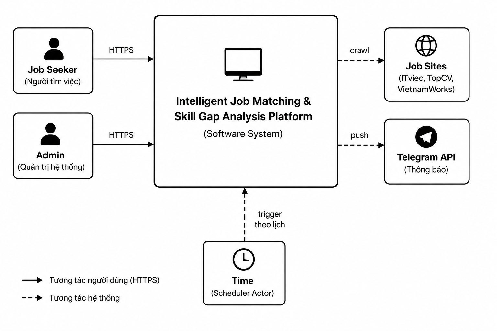

# Job Matching & Skill Gap Platform

> Nền tảng tổng hợp, phân tích và gợi ý việc làm thông minh cho người tìm việc tại Việt Nam

---

## Mục lục

1. [Project Overview](#1-project-overview)
2. [Business Problem](#2-business-problem)
3. [Project Goals](#3-project-goals)
4. [Scope](#4-scope)
5. [Assumptions & Constraints](#5-assumptions--constraints)
6. [Functional Requirements](#6-functional-requirements)
7. [Non-Functional Requirements](#7-non-functional-requirements)
8. [User Roles & Actors](#8-user-roles--actors)
9. [User Flow](#9-user-flow)
10. [High-Level Architecture](#10-high-level-architecture)
11. [Technology Selection](#11-technology-selection)
12. [Database Design](#12-database-design)
13. [ERD](#13-erd)
14. [API Contract](#14-api-contract)
15. [UML Diagrams](#15-uml-diagrams)
16. [Folder Structure](#16-folder-structure)
17. [Development Roadmap](#17-development-roadmap)

---

## 1. Project Overview

| | |
|---|---|
| **Tên dự án** | Job Matching & Skill Gap Platform |
| **Ngôn ngữ tài liệu** | Tiếng Việt |
| **Kiến trúc** | Modular Monolith (Java) + AI/Data Service (Python) |

### Tech Stack tóm tắt

`Java 21` · `Spring Boot 3` · `Next.js 14` · `FastAPI` · `PostgreSQL 16` · `pgvector` · `Redis` · `Scrapy` · `Playwright` · `Docker Compose` · `Flyway` · `sentence-transformers` · `XGBoost`

---

## 2. Business Problem

Người tìm việc tại Việt Nam đang gặp **ba khó khăn lớn** chưa được giải quyết đồng thời bởi bất kỳ nền tảng hiện có nào:

| # | Vấn đề | Hệ quả |
|---|--------|--------|
| 1 | Thông tin tuyển dụng **phân tán** trên nhiều site (ITViec, TopCV, VietnamWorks, LinkedIn), không được chuẩn hóa | Người dùng phải truy cập nhiều nguồn, tốn thời gian, dễ bỏ sót cơ hội |
| 2 | Khó **tự đánh giá kỹ năng còn thiếu** so với yêu cầu thị trường theo từng nhóm nghề | Không biết nên học gì tiếp theo để tăng khả năng trúng tuyển |
| 3 | Không biết **mức độ cạnh tranh** của một vị trí để ưu tiên ứng tuyển hợp lý | Lãng phí nỗ lực vào những vị trí quá khó hoặc bỏ qua vị trí phù hợp |

### Bối cảnh thị trường

- Thị trường tuyển dụng IT Việt Nam có hàng chục nghìn tin tuyển dụng mới mỗi tháng, trải rộng trên nhiều nền tảng với định dạng khác nhau.
- Người tìm việc thiếu công cụ phân tích **cá nhân hóa** để đưa ra quyết định ứng tuyển dựa trên dữ liệu.

---

## 3. Project Goals

### 3.1 Mục tiêu học thuật

Dự án được xây dựng với mục tiêu học có hệ thống các chủ đề sau:

| Chủ đề | Công nghệ / Concept |
|--------|---------------------|
| Software Engineering & System Design | Clean Architecture, DDD, Layered Architecture |
| Backend Development | Java 21, Spring Boot 3, REST API, JWT Security |
| Frontend Development | Next.js 14, App Router, Server Components, API Integration |
| Data Engineering | Scrapy, ETL Pipeline, Data Quality, Data Warehouse |
| AI / NLP | Sentence Embeddings (SBERT), Vector Search, XGBoost, NLP Normalization |
| DevOps | Docker Compose, CI/CD (GitHub Actions), Flyway |

### 3.2 Mục tiêu sản phẩm (MVP)

Hệ thống MVP cần đạt được:

1. Tổng hợp và chuẩn hóa tin tuyển dụng từ nhiều nguồn vào một nơi.
2. Gợi ý việc làm phù hợp với hồ sơ người dùng dựa trên AI matching.
3. Phân tích kỹ năng còn thiếu (Skill Gap) so với nhóm nghề mục tiêu.
4. Hiển thị mức độ cạnh tranh của từng vị trí tuyển dụng.
5. Gửi thông báo việc làm phù hợp qua Telegram.
6. Cung cấp dashboard xu hướng lương theo ngành và địa điểm.

> **TODO:** Định nghĩa Success Metrics (KPI) cụ thể cho từng mục tiêu sản phẩm — ví dụ: "matchScore accuracy > 80% trên test set", "recommendation latency < 2s". Bổ sung trong Giai đoạn 0.1.

---

## 4. Scope

### 4.1 Trong phạm vi (In Scope)

| Tính năng | Mô tả |
|-----------|-------|
| **Xác thực người dùng** | Đăng ký, đăng nhập, quản lý JWT, liên kết Telegram |
| **Hồ sơ người dùng** | Thông tin cá nhân, kỹ năng, chứng chỉ |
| **Thu thập dữ liệu** | Crawl tin tuyển dụng từ ITViec, TopCV, VietnamWorks, LinkedIn theo lịch |
| **ETL & Data Quality** | Chuẩn hóa, làm sạch, dedup dữ liệu; tracking chất lượng |
| **AI Matching** | Gợi ý Top-N việc làm phù hợp (two-stage: Recall + Ranking) |
| **Skill Gap Analysis** | Phân tích kỹ năng còn thiếu theo job family, xếp hạng ưu tiên |
| **Competition Score** | Tính mức độ cạnh tranh của từng vị trí tuyển dụng |
| **Salary Trend** | Dashboard xu hướng lương theo ngành và địa điểm |
| **Thông báo Telegram** | Gửi gợi ý việc làm qua Telegram Bot |
| **Admin Dashboard** | Theo dõi Data Quality, quản lý crawler |

### 4.2 Ngoài phạm vi (Out of Scope)

| Tính năng | Lý do loại trừ |
|-----------|----------------|
| Cho phép nhà tuyển dụng đăng tin | Ngoài mục tiêu MVP; có thể xem xét ở Phase sau |
| Resume Parsing (đọc file CV) | Độ phức tạp cao; ngoài phạm vi Phase 0–2 |
| Hệ thống nhắn tin giữa ứng viên và nhà tuyển dụng | Ngoài phạm vi |
| Mobile App | Chỉ hỗ trợ Web (Next.js) |
| Multi-language (Tiếng Anh) | Chỉ hỗ trợ tiếng Việt trong MVP |
| Payment / Premium features | Ngoài phạm vi |

> **TODO:** Review lại Out of Scope khi hoàn thiện Phase 0 để đảm bảo không có feature nào bị bỏ sót hoặc hiểu nhầm.

---

## 5. Assumptions & Constraints

### 5.1 Giả định (Assumptions)

| # | Giả định |
|---|----------|
| A-01 | Dữ liệu crawl từ các job site đủ về số lượng (>50.000 tin) và chất lượng để train/validate AI model |
| A-02 | Các job site mục tiêu (ITViec, TopCV, VietnamWorks) có thể crawl được trong phạm vi phục vụ nghiên cứu |
| A-03 | Dữ liệu salary được công khai đủ để tính xu hướng (ít nhất 30% tin đăng salary) |
| A-04 | Người dùng mục tiêu là IT professionals tại Việt Nam (Fresher đến Senior) |
| A-05 | Hệ thống chạy trên môi trường đơn server (Docker Compose) — không yêu cầu distributed deployment ở giai đoạn đầu |
| A-06 | Model SBERT được chọn là `paraphrase-multilingual-MiniLM-L12-v2` (hỗ trợ tiếng Việt) trừ khi có lý do thay đổi |

### 5.2 Ràng buộc (Constraints)

| # | Ràng buộc |
|---|-----------|
| C-01 | **Pháp lý:** Crawl dữ liệu chỉ phục vụ mục đích nghiên cứu cá nhân; không sử dụng thương mại. Cần review ToS của từng job site |
| C-02 | **Ngân sách:** Dự án cá nhân, không có ngân sách cloud; deploy trên local/VPS cá nhân |
| C-03 | **Team size:** 1 người — thiết kế cần ưu tiên đơn giản, tránh over-engineering |
| C-04 | **Công nghệ:** Backend bắt buộc dùng Java Spring Boot (mục tiêu học); AI service bắt buộc dùng Python |
| C-05 | **Giai đoạn 0:** Không được bắt đầu code trước khi hoàn thiện tài liệu thiết kế |

---

## 6. Functional Requirements

> **Ghi chú:** Các FR dưới đây được derive từ Problem Statement, Project Goals và API Contract. Acceptance Criteria sẽ được bổ sung chi tiết trong Giai đoạn 0.1.

### 6.1 Authentication & Account Management

| ID | Requirement | Priority |
|----|-------------|----------|
| FR-01 | Người dùng có thể đăng ký tài khoản bằng email và mật khẩu | Must Have |
| FR-02 | Người dùng có thể đăng nhập và nhận JWT (Access Token + Refresh Token) | Must Have |
| FR-03 | Access Token có thể được làm mới bằng Refresh Token mà không cần đăng nhập lại | Must Have |
| FR-04 | Người dùng có thể liên kết tài khoản Telegram để nhận thông báo | Should Have |

### 6.2 User Profile Management

| ID | Requirement | Priority |
|----|-------------|----------|
| FR-05 | Người dùng có thể xem và cập nhật hồ sơ cá nhân (tên, vị trí hiện tại, địa điểm, mức lương kỳ vọng) | Must Have |
| FR-06 | Người dùng có thể thêm, sửa, xóa kỹ năng trong hồ sơ; kỹ năng phải được chọn từ danh mục chuẩn hóa | Must Have |
| FR-07 | Người dùng có thể thêm chứng chỉ nghề nghiệp vào hồ sơ | Should Have |

> **TODO:** Bổ sung FR cho `user_experience` (kinh nghiệm làm việc) và `user_education` (học vấn) — hai entity này cần thiết cho AI matching nhưng chưa được định nghĩa rõ trong Phase 0. Xem DESIGN_REVIEW.md §4.

### 6.3 Job Data & Discovery

| ID | Requirement | Priority |
|----|-------------|----------|
| FR-08 | Hệ thống tự động crawl tin tuyển dụng từ ITViec, TopCV, VietnamWorks, LinkedIn theo lịch định kỳ | Must Have |
| FR-09 | Dữ liệu crawl được chuẩn hóa (kỹ năng, địa điểm, mức lương, job family) và lưu vào database | Must Have |
| FR-10 | Người dùng có thể xem chi tiết một tin tuyển dụng | Must Have |
| FR-11 | Người dùng có thể tìm kiếm kỹ năng từ danh mục chuẩn hóa (autocomplete) | Must Have |

### 6.4 AI Matching & Recommendation

| ID | Requirement | Priority |
|----|-------------|----------|
| FR-12 | Hệ thống gợi ý Top-N việc làm phù hợp nhất với hồ sơ người dùng | Must Have |
| FR-13 | Mỗi gợi ý kèm theo `matchScore` tổng hợp và điểm thành phần (skill, experience, education, cert) | Must Have |
| FR-14 | Matching sử dụng two-stage pipeline: **Recall** (vector search — FastAPI) → **Ranking** (score assembly — Spring Boot) | Must Have |
| FR-15 | Người dùng có thể xem phân tích kỹ năng còn thiếu (Skill Gap) theo nhóm nghề (job family) | Must Have |
| FR-16 | Skill Gap result xếp hạng kỹ năng thiếu theo mức độ ưu tiên và giải thích lý do | Should Have |

### 6.5 Competition Score

| ID | Requirement | Priority |
|----|-------------|----------|
| FR-17 | Hệ thống tính và hiển thị mức độ cạnh tranh của từng vị trí tuyển dụng | Should Have |

> **TODO:** Định nghĩa rõ công thức / input features của Competition Score — cạnh tranh được đo bằng gì? (số lượng job cùng category, mức độ khan hiếm kỹ năng yêu cầu, salary range vs market). Xem DESIGN_REVIEW.md §1.

### 6.6 Salary Trend Dashboard

| ID | Requirement | Priority |
|----|-------------|----------|
| FR-18 | Hệ thống hiển thị xu hướng lương theo ngành (`industry`) và địa điểm (`location`) | Should Have |

### 6.7 Notification

| ID | Requirement | Priority |
|----|-------------|----------|
| FR-19 | Hệ thống gửi thông báo việc làm phù hợp cho người dùng qua Telegram Bot | Should Have |
| FR-20 | Thông báo chứa danh sách Top-N việc làm mới nhất phù hợp với hồ sơ | Should Have |

### 6.8 Admin

| ID | Requirement | Priority |
|----|-------------|----------|
| FR-21 | Admin có thể xem thống kê chất lượng dữ liệu (Data Quality) sau mỗi lần crawl | Must Have |

> **TODO:** Bổ sung FR cho Admin: quản lý skill dictionary, trigger crawl thủ công, xem crawl run logs. Xem DESIGN_REVIEW.md §5.

---

## 7. Non-Functional Requirements

> **TODO:** Các giá trị cụ thể bên dưới là *target ban đầu* cho dự án cá nhân/portfolio. Cần validate và điều chỉnh dựa trên benchmark thực tế trong Phase 1.

### 7.1 Performance

| ID | Requirement | Target |
|----|-------------|--------|
| NFR-01 | Latency API recommendation end-to-end (P95) | < 3 giây |
| NFR-02 | Latency API thông thường (GET profile, GET job detail) (P95) | < 500ms |
| NFR-03 | Thời gian hoàn thành Skill Gap analysis | < 5 giây |
| NFR-04 | Throughput tối thiểu (concurrent users) | 50 concurrent users |

### 7.2 Availability & Reliability

| ID | Requirement | Target |
|----|-------------|--------|
| NFR-05 | Uptime của hệ thống (local/VPS deployment) | > 95% (dự án cá nhân) |
| NFR-06 | Hệ thống phải trả về lỗi rõ ràng (RFC 7807) khi AI service không khả dụng, thay vì crash | Must Have |

### 7.3 Data Freshness

| ID | Requirement | Target |
|----|-------------|--------|
| NFR-07 | Tần suất crawl tin tuyển dụng mới | Mỗi 6 giờ |
| NFR-08 | Job posting hết hạn phải được đánh dấu `EXPIRED` trong vòng | 24 giờ sau khi phát hiện |

### 7.4 Security

| ID | Requirement |
|----|-------------|
| NFR-09 | JWT Access Token có thời hạn tối đa 15 phút; Refresh Token tối đa 7 ngày |
| NFR-10 | Mật khẩu phải được hash bằng BCrypt (cost factor ≥ 12) |
| NFR-11 | `/internal/v1/` endpoints chỉ được gọi từ internal network (không expose ra public) |
| NFR-12 | Telegram webhook phải verify Telegram signature |

### 7.5 Maintainability

| ID | Requirement |
|----|-------------|
| NFR-13 | Schema database thay đổi phải qua Flyway migration script — không cho phép thay đổi schema thủ công |
| NFR-14 | Code coverage tối thiểu cho unit test: 70% (backend), 60% (AI service) |

### 7.6 Scalability (Future)

> Đây là các ràng buộc thiết kế *hướng tới*, không phải yêu cầu bắt buộc trong MVP.

- Database domain được tổ chức theo Bounded Context → có thể tách thành microservice độc lập khi cần.
- Sử dụng pgvector thay vì FAISS/Milvus để giảm moving parts trong MVP; sẵn sàng migrate nếu cần scale vector search.
- PostgreSQL đảm nhận cả OLTP và DWH trong MVP — **đây là trade-off có chủ đích**. Khi volume data analytics lớn, sẽ tách OLAP sang công cụ riêng (ClickHouse, DuckDB).

---

## 8. User Roles & Actors

### 8.1 Human Actors

| Actor | Mô tả | Quyền hạn chính |
|-------|--------|----------------|
| **Job Seeker** | Người tìm việc — actor chính của hệ thống | Quản lý hồ sơ, xem gợi ý việc làm, xem skill gap, nhận thông báo |
| **Administrator** | Quản trị viên hệ thống | Theo dõi data quality, quản lý crawler, quản lý danh mục kỹ năng |

> **TODO:** Bổ sung chi tiết quyền hạn của Administrator (RBAC matrix). Xem DESIGN_REVIEW.md §1.

### 8.2 System Actors

| Actor | Mô tả |
|-------|--------|
| **Time Trigger** | Kích hoạt Data Pipeline theo lịch (cron) — crawl, ETL, embedding update |
| **Telegram API** | External service nhận thông báo đẩy từ hệ thống |

### 8.3 External Systems (Data Sources)

| External System | Vai trò |
|-----------------|--------|
| **ITViec** | Nguồn dữ liệu tuyển dụng IT |
| **TopCV** | Nguồn dữ liệu tuyển dụng đa ngành |
| **VietnamWorks** | Nguồn dữ liệu tuyển dụng đa ngành |
| **LinkedIn** | Nguồn dữ liệu tuyển dụng quốc tế |



---

## 9. User Flow

> **TODO:** Vẽ Activity Diagram / User Journey Map chi tiết cho từng flow dưới đây trong Giai đoạn 0.5. Dưới đây là mô tả flow cấp cao.

### 9.1 Flow — Đăng ký và thiết lập hồ sơ

```
1. Người dùng truy cập web → Đăng ký bằng email/password
2. Hệ thống tạo tài khoản, trả về JWT
3. Người dùng điền hồ sơ: tên, vị trí, địa điểm, mức lương kỳ vọng
4. Người dùng thêm kỹ năng từ danh mục chuẩn hóa (autocomplete)
5. [Tùy chọn] Người dùng liên kết tài khoản Telegram
6. Hệ thống sẵn sàng cung cấp gợi ý
```

### 9.2 Flow — Xem gợi ý việc làm (Recommendation)

```
1. Người dùng truy cập trang "Gợi ý việc làm"
2. Frontend gọi GET /api/v1/me/recommendations
3. Spring Boot gọi FastAPI /internal/v1/candidates → Recall ~200 candidates (vector search)
4. FastAPI tính match signal cho từng candidate → trả về Spring Boot
5. Spring Boot tính matchScore (Gate + weighted score) → sort → trả về Top-N
6. Frontend hiển thị danh sách với matchScore và điểm thành phần
7. Người dùng click vào job → xem chi tiết + competition score
```

### 9.3 Flow — Phân tích Skill Gap

```
1. Người dùng chọn nhóm nghề mục tiêu (job family)
2. Frontend gọi GET /api/v1/me/skill-gap?jobFamily=...
3. Spring Boot gọi FastAPI /internal/v1/skill-gap
4. FastAPI so sánh user skills vs. required skills của job family
5. Trả về danh sách kỹ năng còn thiếu, xếp hạng theo tần suất xuất hiện trong JD
6. Frontend hiển thị skill gap analysis với gợi ý ưu tiên học
```

### 9.4 Flow — Data Pipeline (Tự động theo lịch)

```
1. Time Trigger kích hoạt Crawler theo lịch (mỗi 6 giờ)
2. Scrapy + Playwright crawl dữ liệu từ các job site → lưu vào raw_job_posting
3. ETL job: chuẩn hóa, dedup, skill normalization → lưu vào job, job_skill
4. Embedding job: tạo job_embedding cho tin tuyển dụng mới (gọi FastAPI)
5. Data quality job: tính data_quality_metric, log vào crawl_run
6. Admin có thể xem kết quả qua GET /api/v1/admin/data-quality
```

---

## 10. High-Level Architecture

### 10.1 Quyết định kiến trúc

Hệ thống được thiết kế theo mô hình **Modular Monolith (Java) + AI/Data Service (Python)**.

Nguyên tắc phân tách:
- **Theo ngôn ngữ:** Java (business logic) vs. Python (AI/Data)
- **Theo vòng đời xử lý:** Real-time API (Spring Boot) vs. Batch Processing (Data Pipeline)

Lý do *không* chọn full Microservice: độ phức tạp vận hành quá cao cho dự án cá nhân 1 người; Modular Monolith vẫn đảm bảo Separation of Concerns và dễ tách service về sau.

### 10.2 Sơ đồ kiến trúc

```text
┌─────────────────────────────────────────────────────────────────┐
│                         CLIENT LAYER                            │
│                    Next.js 14 (Browser)                         │
│                   HTTPS / REST / JWT Bearer                     │
└────────────────────────────┬────────────────────────────────────┘
                             │
┌────────────────────────────▼────────────────────────────────────┐
│                      BACKEND LAYER                              │
│                   Spring Boot 3 (Java 21)                       │
│         Business Logic · REST API · JWT Security                │
│         ┌──────────┐  ┌───────────┐  ┌────────────┐             │
│         │Controller│→ │ Service   │→ │ Repository │             │
│         │  (REST)  │  │(Use Case) │  │  (JPA)     │             │
│         └──────────┘  └─────┬─────┘  └─────┬──────┘             │
│                             │              │                    │
│            ┌────────────────┘              │                    │
│            │ REST (internal)               │                    │
└────────────┼───────────────────────────────┼────────────────────┘
             │                               │
┌────────────▼──────────┐    ┌───────────────▼───────────────────┐
│   FastAPI AI Service  │    │         DATA LAYER                │
│       (Python)        │    │   PostgreSQL 16 + pgvector        │
│  SBERT · XGBoost      │    │   (OLTP + Data Warehouse)         │
│  Recall · Ranking     │    │                                   │
│  Skill Gap · Compete  │    │             Redis                 │
└───────────────────────┘    │  (Cache · Session · Rate Limit)   │
                             └───────────────────────────────────┘
                                          ▲
                             ┌────────────┘
┌────────────────────────────┴──────────────────────────────────┐
│                    DATA PIPELINE LAYER                        │
│              Scrapy + Playwright (Python)                     │
│         Crawl → raw_job_posting → ETL → job / job_skill       │
│         → Embedding (FastAPI) → job_embedding                 │
│                    [Batch, theo lịch]                         │
└───────────────────────────────────────────────────────────────┘
```

### 10.3 Vai trò của từng thành phần

| Thành phần | Công nghệ | Chức năng chính |
|------------|-----------|-----------------|
| **Frontend** | Next.js 14 | Dashboard người dùng, hiển thị gợi ý, skill gap, trend |
| **Spring Boot Backend** | Java 21, Spring Boot 3 | Business logic, REST API, JWT auth, score assembly, điều phối |
| **FastAPI AI Service** | Python, FastAPI | Embedding generation, vector search (Recall), match signal (Ranking), Skill Gap, Competition Score |
| **Data Pipeline** | Python, Scrapy, Playwright | Crawl → ETL → Embedding batch update |
| **PostgreSQL** | PostgreSQL 16 + pgvector | Lưu trữ OLTP + Data Warehouse + Vector Store |
| **Redis** | Redis 7 | Cache kết quả AI (TTL), session management, rate limiting |

### 10.4 Communication Protocol

| Từ | Đến | Protocol | Ghi chú |
|----|-----|----------|---------|
| Frontend | Spring Boot | HTTPS REST + JWT Bearer | Public API `/api/v1/` |
| Spring Boot | FastAPI | HTTP REST (internal) | `/internal/v1/` — chỉ trong internal network |
| Spring Boot | PostgreSQL | JDBC / JPA | Connection Pool (HikariCP) |
| Spring Boot | Redis | Lettuce (Redis Client) | Cache, Session |
| Data Pipeline | PostgreSQL | SQLAlchemy | Batch write |
| Data Pipeline | FastAPI | HTTP REST | Gọi embedding endpoint |

### 10.5 Fallback Strategy

> **TODO:** Thiết kế chi tiết fallback khi FastAPI không khả dụng. Hướng xử lý dự kiến: Spring Boot detect timeout → trả về cached result từ Redis (nếu có) → nếu không có cache, trả về `503 Service Unavailable` với message rõ ràng. Xem DESIGN_REVIEW.md §2.

### 10.6 Spring Boot — Layered Architecture

```text
presentation/     ← Controller, Request/Response DTO, Mapper
    │
application/      ← Use Case, Application Service, Port (interface)
    │
domain/           ← Entity, Value Object, Domain Service, Domain Event
    │
infrastructure/   ← Repository Impl (JPA), External Service Adapter (FastAPI, Redis, Telegram)
```

---

## 11. Technology Selection

### 11.1 Core Stack

| Công nghệ | Phục vụ yêu cầu | Phương án thay thế | Lý do chọn |
|-----------|-----------------|-------------------|------------|
| **Java 21 / Spring Boot 3** | Backend enterprise, REST API, Security | Node.js, ASP.NET | Hệ sinh thái enterprise mạnh; Virtual Thread (Java 21) tăng throughput; mục tiêu học |
| **FastAPI** | AI Inference Service | Flask, Django | Async native; Pydantic validation; OpenAPI tự động; phù hợp AI service |
| **PostgreSQL 16** | OLTP + Data Warehouse | MySQL, MongoDB | ACID mạnh; pgvector extension; SQL mạnh cho analytics; dễ JOIN |
| **pgvector** | Semantic Vector Search | FAISS, Milvus, Qdrant | Tích hợp trực tiếp PostgreSQL — không cần thêm hệ thống; đủ cho MVP với ~100k docs |
| **Redis 7** | Cache, Session, Rate Limit | Memcached | TTL linh hoạt; Sorted Set cho ranking cache; Pub/Sub cho future use |
| **Next.js 14** | Web Dashboard | React SPA, Vue | App Router; Server Components; SSR tốt cho SEO; cấu trúc project rõ ràng |
| **Scrapy + Playwright** | Crawl dữ liệu tuyển dụng | BeautifulSoup, Selenium | Scrapy: crawl nhanh, async; Playwright: xử lý website JavaScript-rendered |
| **Docker Compose** | Local deployment & demo | Cài thủ công | Tái tạo môi trường nhanh; dễ CI/CD; phù hợp single-server |

### 11.2 AI / ML Stack

| Công nghệ | Phục vụ yêu cầu | Ghi chú |
|-----------|-----------------|---------|
| `sentence-transformers` | SBERT embedding | Model: `paraphrase-multilingual-MiniLM-L12-v2` (768 dim, hỗ trợ tiếng Việt) |
| `xgboost` | Ranking model | XGBoost LambdaRank cho Ranking stage |
| `numpy` / `pandas` | Feature engineering | Tính toán features cho ranking |
| `scikit-learn` | Preprocessing, evaluation | Pipeline ML cơ bản |

### 11.3 Engineering Tools

| Công nghệ | Phục vụ yêu cầu | Ghi chú |
|-----------|-----------------|---------|
| **Flyway** | Database Migration | Quản lý schema version; bắt buộc từ Sprint 1 |
| **JUnit 5 + Testcontainers** | Backend Testing | Unit test + Integration test với PostgreSQL thật |
| **Pytest** | AI Service Testing | Unit test FastAPI endpoints và ML functions |
| **GitHub Actions** | CI/CD | Chạy test, build Docker image tự động |
| **Spring Actuator + Prometheus** | Monitoring | Health check, metrics endpoint |

### 11.4 Trade-off Notes

> **PostgreSQL OLTP + DWH:** Đây là **conscious trade-off** để giảm complexity. Khi data analytics lớn hoặc analytical query ảnh hưởng đến OLTP performance, sẽ xem xét tách sang ClickHouse hoặc DuckDB.

> **pgvector vs. FAISS/Milvus:** pgvector đủ cho MVP (~100k jobs). Nếu cần scale lên triệu docs hoặc cần ANN index phức tạp hơn, sẽ migrate sang Milvus/Qdrant.

---

## 12. Database Design

### 12.1 Design Conventions

| Convention | Quyết định |
|------------|-----------|
| **Naming** | `snake_case` cho tất cả table và column |
| **Primary Key** | `UUID v7` — sortable, globally unique, phù hợp future sharding |
| **Audit Fields** | Tất cả table có: `created_at TIMESTAMPTZ NOT NULL DEFAULT NOW()`, `updated_at TIMESTAMPTZ NOT NULL DEFAULT NOW()` |
| **Soft Delete** | Dùng `deleted_at TIMESTAMPTZ NULL` — NULL = active, NOT NULL = deleted |
| **Enum Values** | `ALL_CAPS` (ví dụ: `ACTIVE`, `EXPIRED`, `PENDING`) |
| **Boolean** | `is_` prefix (ví dụ: `is_required`, `is_active`) |

> **TODO:** Document chi tiết Primary Key generation strategy (UUID v7 library: `com.github.f4b6a3:uuid-creator`). Xem DESIGN_REVIEW.md §4.

### 12.2 Index Strategy

> **TODO:** Bổ sung đầy đủ index strategy với justification. Các index tối thiểu cần có:

| Table | Column(s) | Index Type | Lý do |
|-------|-----------|------------|-------|
| `job` | `(status, posted_at DESC)` | B-tree | Filter active jobs, sort by date |
| `job` | `(job_family_id, status)` | B-tree | Skill gap query by job family |
| `user_skill` | `(user_id, skill_id)` | B-tree Unique | Lookup user's skills, prevent duplicate |
| `job_skill` | `(job_id)` | B-tree | Lookup skills required for a job |
| `job_embedding` | `(embedding)` | HNSW (pgvector) | Vector similarity search — HNSW cho latency tốt hơn ivfflat |
| `raw_job_posting` | `(source_url)` | B-tree Unique | Dedup check khi crawl |
| `crawl_run` | `(started_at DESC)` | B-tree | Query crawl history |

### 12.3 Domains & Entities

#### Domain 1: Authentication

*Chịu trách nhiệm xác thực, phân quyền và quản lý tài khoản. Tách biệt với User Domain để tuân theo Separation of Concerns — thông tin đăng nhập không được mix với thông tin hồ sơ.*

| Entity | Mô tả |
|--------|-------|
| `user_credential` | Thông tin đăng nhập: `email` (unique), `password_hash` (BCrypt), `is_active`, `email_verified_at` |
| `role` | Danh sách vai trò hệ thống: `ROLE_JOB_SEEKER`, `ROLE_ADMIN` |
| `user_role` | Quan hệ N-N giữa `user_credential` và `role` |

#### Domain 2: User

*Quản lý hồ sơ nghề nghiệp của người dùng — tách biệt với Authentication để mỗi domain có lifecycle riêng.*

| Entity | Mô tả |
|--------|-------|
| `user_profile` | Hồ sơ cá nhân: `full_name`, `title`, `location_id`, `expected_salary`, `job_family_id` |
| `user_skill` | Kỹ năng người dùng: FK → `skill`, `years_of_experience`, `proficiency_level` |
| `user_certification` | Chứng chỉ: `name`, `issuer`, `issued_at`, `expires_at` |
| `telegram_link` | Liên kết Telegram: `telegram_user_id`, `chat_id`, `is_active` |

> **TODO:** Thêm entity `user_experience` (lịch sử công việc: company, title, start/end date) và `user_education` (học vấn: institution, degree, field, GPA). Hai entity này là feature input quan trọng cho AI matching. Xem DESIGN_REVIEW.md §4 & §8.

#### Domain 3: Job

*Quản lý dữ liệu tuyển dụng đã được ETL và chuẩn hóa.*

| Entity | Mô tả |
|--------|-------|
| `company` | Thông tin công ty: `name`, `industry_id`, `location_id`, `size` |
| `job` | Tin tuyển dụng: `title`, `company_id`, `job_family_id`, `location_id`, `salary_min/max`, `status` (`ACTIVE`/`EXPIRED`/`DELETED`), `source_url`, `posted_at`, `expired_at` |
| `job_skill` | Kỹ năng yêu cầu: FK → `skill`, `is_required` (must-have vs. nice-to-have) |
| `job_embedding` | Vector embedding của job description: `embedding vector(768)`, `model_name`, `model_version`, `created_at` |

> **Ghi chú `job_embedding`:** Dimension = 768 (SBERT `paraphrase-multilingual-MiniLM-L12-v2`). Field `model_name` và `model_version` cho phép phát hiện embedding nào cần regenerate khi đổi model.

#### Domain 4: Dictionary

*Các bảng danh mục chuẩn hóa dùng chung toàn hệ thống. Đây là Master Data — không cho phép thay đổi tự do, phải qua Admin.*

| Entity | Mô tả |
|--------|-------|
| `skill` | Danh mục kỹ năng chuẩn hóa: `name` (canonical), `skill_category_id` |
| `skill_alias` | Đồng nghĩa kỹ năng: `alias` → FK `skill` (ví dụ: "ReactJS" → "React") |
| `location` | Địa điểm: `city`, `country` |
| `education_level` | Lookup table: `HIGH_SCHOOL`, `COLLEGE`, `BACHELOR`, `MASTER`, `PHD` |
| `industry` | Ngành nghề: `name` (ví dụ: "Information Technology", "Finance") |
| `job_family` | Nhóm nghề nghiệp: `name` (ví dụ: "Backend Engineer", "Data Scientist") |
| `weight_profile` | Cấu hình trọng số MatchScore theo job family: `job_family_id`, `skill_weight`, `experience_weight`, `education_weight`, `cert_weight` (tổng = 1.0) |

> **TODO:** Thêm entity `skill_category` để tạo skill taxonomy hierarchy (ví dụ: Programming Language → Python → Data Science Libraries). Cần thiết cho Skill Gap analysis chính xác theo nhóm. Xem DESIGN_REVIEW.md §8.

#### Domain 5: Matching

*Lưu kết quả AI và lịch sử matching để phục vụ analytics và future model training.*

| Entity | Mô tả |
|--------|-------|
| `match_history` | Kết quả matching: `user_id`, `job_id`, `match_score`, `skill_score`, `exp_score`, `edu_score`, `cert_score`, `created_at` |
| `competition_prediction` | Điểm cạnh tranh: `job_id`, `competition_score`, `model_version`, `computed_at` |

> **TODO:** Thêm entity `user_embedding` (vector của user profile) và `user_interaction` (hành vi người dùng: job_view, job_save — để thu thập implicit feedback cho future model training). Xem DESIGN_REVIEW.md §8.

#### Domain 6: Notification

*Quản lý thông báo gửi qua Telegram.*

| Entity | Mô tả |
|--------|-------|
| `notification` | Lịch sử thông báo: `user_id`, `channel` (`TELEGRAM`), `type` (`JOB_RECOMMENDATION`), `status` (`PENDING`/`SENT`/`FAILED`), `sent_at`, `error_message` |
| `notification_job` *(Optional)* | Liên kết thông báo với danh sách job được gửi: `notification_id`, `job_id` |

#### Domain 7: Data Pipeline

*Quản lý và audit quá trình thu thập, xử lý dữ liệu.*

| Entity | Mô tả |
|--------|-------|
| `crawl_run` | Nhật ký crawler: `source` (ITViec/TopCV/...), `status` (`RUNNING`/`SUCCESS`/`FAILED`), `started_at`, `ended_at`, `jobs_found`, `jobs_inserted`, `error_message` |
| `raw_job_posting` | Dữ liệu thô từ crawler: `source`, `source_url` (unique), `raw_html` / `raw_json`, `crawled_at`, `etl_status` |
| `data_quality_metric` | Chất lượng dữ liệu sau ETL: `crawl_run_id`, `total_raw`, `parsed_success`, `failed_parsing`, `duplicate_count`, `missing_salary_pct`, `missing_skill_pct` |

---

## 13. ERD

> **Xem ERD chi tiết tại:** [dbdiagram.io — Job Matching & Skill Gap Platform](https://dbdiagram.io/d/Job-Matching-and-Skill-Gap-Platform-6a3f3fe8b3ebc94a7da2539f)

> **TODO:** Export ERD thành file ảnh và lưu vào `/docs/erd.png`, sau đó nhúng vào đây để xem offline mà không phụ thuộc external link. Ưu tiên hoàn thành trong Giai đoạn 0.3. Xem DESIGN_REVIEW.md §4.

---

## 14. API Contract

### 14.1 HTTP Status Code Reference

| Code | Ý nghĩa |
|------|---------|
| `200` | OK — Thành công |
| `201` | Created — Tạo resource mới thành công |
| `202` | Accepted — Đã nhận, đang xử lý bất đồng bộ |
| `400` | Bad Request — Request sai cú pháp |
| `401` | Unauthorized — Chưa xác thực |
| `403` | Forbidden — Không đủ quyền |
| `404` | Not Found — Không tìm thấy resource |
| `409` | Conflict — Xung đột (ví dụ: email đã tồn tại) |
| `422` | Unprocessable Entity — Cú pháp đúng nhưng nghiệp vụ không hợp lệ |
| `429` | Too Many Requests — Vượt rate limit |
| `500` | Internal Server Error — Lỗi server |

### 14.2 Quy ước chung

- **Base path (Public):** `/api/v1/` — khi cần version mới, tạo `/api/v2/` song song
- **Base path (Internal):** `/internal/v1/` — chỉ gọi nội bộ từ Spring Boot đến FastAPI; không expose ra internet
- **Authentication:** JWT Bearer Token cho mọi endpoint trừ `/api/v1/auth/*`
- **Current user:** Dùng `/me` thay vì `/users/{id}` cho các endpoint của người dùng hiện tại
- **Pagination:** Tất cả endpoint trả danh sách dùng `?page=&size=` (mặc định `size=20`, max `size=100`). Response wrapper: `{ page, size, totalElements, totalPages, content[] }`

### 14.3 Error Response (RFC 7807 — Problem Details)

```json
{
  "type": "https://api.example.com/problems/conflict",
  "title": "Email already exists",
  "status": 409,
  "detail": "Email 'a@b.com' đã được đăng ký.",
  "instance": "/api/v1/auth/register",
  "timestamp": "2026-06-28T10:20:30Z",
  "traceId": "5f1c7c1a5b",
  "errors": [
    { "field": "email", "message": "must be unique" }
  ]
}
```

> `errors[]` chỉ xuất hiện khi lỗi validation (`422`). Với `409 Conflict`, field `detail` mô tả nguyên nhân cụ thể.

### 14.4 Public API — Endpoint Contract

| Method | Endpoint | Chức năng | Auth | Request | Response | Success | Error |
|--------|----------|-----------|------|---------|----------|---------|-------|
| `POST` | `/api/v1/auth/register` | Đăng ký tài khoản | Public | `RegisterRequest` | `UserResponse` | `201` | `400`, `409`, `422` |
| `POST` | `/api/v1/auth/login` | Đăng nhập, nhận JWT | Public | `LoginRequest` | `JwtResponse` | `200` | `400`, `401` |
| `POST` | `/api/v1/auth/refresh` | Làm mới Access Token | Public (Refresh Token) | `RefreshRequest` | `JwtResponse` | `200` | `401` |
| `POST` | `/api/v1/auth/logout` | Vô hiệu hóa Refresh Token | JWT | — | — | `200` | `401` |
| `GET` | `/api/v1/me/profile` | Xem hồ sơ cá nhân | JWT | — | `ProfileResponse` | `200` | `401`, `404` |
| `PUT` | `/api/v1/me/profile` | Cập nhật hồ sơ (replace) | JWT | `UpdateProfileRequest` | `ProfileResponse` | `200` | `400`, `401`, `422` |
| `GET` | `/api/v1/me/skills` | Xem danh sách kỹ năng của tôi | JWT | — | `UserSkillListResponse` | `200` | `401` |
| `POST` | `/api/v1/me/skills` | Thêm kỹ năng vào hồ sơ | JWT | `AddSkillRequest` | `UserSkillResponse` | `201` | `400`, `401`, `409`, `422` |
| `DELETE` | `/api/v1/me/skills/{skillId}` | Xóa kỹ năng khỏi hồ sơ | JWT | Path Variable | — | `204` | `401`, `404` |
| `POST` | `/api/v1/me/telegram` | Liên kết tài khoản Telegram | JWT | `TelegramLinkRequest` | `TelegramLinkResponse` | `200` | `401`, `409` |
| `GET` | `/api/v1/me/recommendations` | Top-N việc làm phù hợp | JWT | `?page=&size=&location=&industry=` | `RecommendationPageResponse` | `200` hoặc `202` | `401`, `429`, `500` |
| `GET` | `/api/v1/me/skill-gap` | Phân tích kỹ năng còn thiếu | JWT | `?jobFamily=` | `SkillGapResponse` | `200` | `401`, `404`, `422` |
| `GET` | `/api/v1/jobs/{id}` | Xem chi tiết tin tuyển dụng | JWT | Path Variable | `JobDetailResponse` | `200` | `401`, `404` |
| `GET` | `/api/v1/jobs/{id}/competition` | Xem mức độ cạnh tranh | JWT | Path Variable | `CompetitionResponse` | `200` | `401`, `404` |
| `GET` | `/api/v1/trends/salary` | Xu hướng lương theo ngành/địa điểm | JWT | `?industry=&location=` | `SalaryTrendResponse` | `200` | `401`, `404` |
| `GET` | `/api/v1/dictionary/skills` | Tìm kiếm kỹ năng (autocomplete) | JWT | `?q=&page=&size=` | `SkillPageResponse` | `200` | `401` |
| `GET` | `/api/v1/admin/data-quality` | Theo dõi chất lượng dữ liệu | JWT + `ROLE_ADMIN` | `?runId=` | `DataQualityResponse` | `200` | `401`, `403`, `404` |

> **TODO:** Bổ sung DTO schema (danh sách fields) cho từng Request/Response DTO. Đây là blocker cho Frontend và Backend develop song song. Ưu tiên cao nhất trong Giai đoạn 0.4. Xem DESIGN_REVIEW.md §5.

> **TODO:** Bổ sung sort/filter parameters chi tiết cho `/me/recommendations` (ví dụ: `sort=matchScore,desc`, `jobType=FULL_TIME`). Xem DESIGN_REVIEW.md §5.

> **TODO:** Document Rate Limiting policy: X requests/minute per user, Y requests/minute per IP. Xem DESIGN_REVIEW.md §5.

### 14.5 Score Assembly — Phân chia trách nhiệm

*"Python trả tín hiệu, Java ráp điểm"*

| Bước | Thực hiện tại | Nội dung |
|------|--------------|----------|
| **Recall** | FastAPI | Vector search `job_embedding` vs. `user_embedding` → chọn ~200 candidate jobs |
| **Match Signal** | FastAPI | Tính cosine similarity của skill embedding cho từng candidate |
| **Score Assembly** | Spring Boot | Đọc `job_skill.is_required` + `user_skill` → tính **Gate** (must-have check) → tính `skill_score`, `exp_score`, `edu_score`, `cert_score` → áp `weight_profile(jobFamily)` → tổng hợp `matchScore` |
| **Final Ranking** | Spring Boot | Sort theo `matchScore DESC` → trả về Top-N |

### 14.6 Internal API (Spring Boot → FastAPI)

> **TODO:** Bổ sung Request/Response DTO schema cho từng Internal API endpoint. Xem DESIGN_REVIEW.md §5.

#### `POST /internal/v1/candidates` — Recall Stage

Trong ~100.000 job embeddings, chọn ra ~200 candidates có vector gần nhất với user embedding. Chưa cần xếp hạng chính xác.

#### `POST /internal/v1/match-signals` — Ranking Stage

Tính match signal (cosine similarity của skill embeddings) cho 200 candidates đã được chọn ở Recall stage.

#### `POST /internal/v1/competition-score` — Competition Analysis

Tính mức độ cạnh tranh của một Job dựa trên các tín hiệu từ thị trường.

> **TODO:** Define input features cho Competition Score. Xem DESIGN_REVIEW.md §1 & §8.

#### `POST /internal/v1/skill-gap` — Skill Gap Analysis

So sánh user skills với required skills của job family mục tiêu. Trả về danh sách kỹ năng còn thiếu, xếp hạng theo tần suất xuất hiện trong job description và mức độ ưu tiên.

---

## 15. UML Diagrams

> **TODO:** Toàn bộ section này sẽ được hoàn thiện trong Giai đoạn 0.5. Dưới đây là danh sách diagram cần vẽ và mô tả mục đích.

### 15.1 Use Case Diagram

**Mục đích:** Tổng quan actor ↔ feature mapping. Phải vẽ trước các diagram khác.

**TODO:** Vẽ Use Case Diagram với PlantUML hoặc Mermaid. Lưu tại `/docs/uml/use-case.png`.

Actors: Job Seeker, Administrator, Time Trigger, Telegram API.

### 15.2 Sequence Diagrams

**Mục đích:** Mô tả luồng tương tác giữa các component theo thời gian cho từng use case quan trọng.

| Diagram | Actors & Systems | Ưu tiên |
|---------|-----------------|---------|
| Authentication Flow | Browser → Spring Boot → PostgreSQL → Browser | 🔴 Must Have |
| Recommendation Flow | Browser → Spring Boot → FastAPI → PostgreSQL → Spring Boot → Browser | 🔴 Must Have |
| Data Pipeline Flow | Time Trigger → Scrapy → raw_job_posting → ETL → job → FastAPI → job_embedding | 🔴 Must Have |
| Skill Gap Flow | Browser → Spring Boot → FastAPI → Spring Boot → Browser | 🟠 High |

**TODO:** Vẽ các Sequence Diagram bằng Mermaid (render trong GitHub). Lưu tại `/docs/uml/seq-*.md`.

### 15.3 State Diagrams

**Mục đích:** Define lifecycle của các entity có trạng thái — tránh bug do transition không được define.

| Entity | States | Ưu tiên |
|--------|--------|---------|
| `job.status` | `ACTIVE` → `EXPIRED` → `DELETED` | 🔴 Must Have |
| `notification.status` | `PENDING` → `SENT` / `FAILED` | 🟠 High |
| `crawl_run.status` | `RUNNING` → `SUCCESS` / `FAILED` | 🟠 High |
| `raw_job_posting.etl_status` | `PENDING` → `PROCESSED` / `FAILED` / `SKIPPED` | 🟡 Medium |

**TODO:** Vẽ State Diagrams. Lưu tại `/docs/uml/state-*.md`.

### 15.4 Deployment Diagram

**Mục đích:** Mô tả Docker containers, ports, network và dependencies.

**TODO:** Vẽ Deployment Diagram thể hiện Docker Compose setup: containers (spring-boot, fastapi, postgres, redis, next-js, scrapy), exposed ports, internal network. Lưu tại `/docs/uml/deployment.png`.

### 15.5 Component Diagram

**Mục đích:** Mô tả các module nội bộ của Spring Boot và dependencies giữa chúng.

**TODO:** Vẽ Component Diagram cho Spring Boot Backend (module: auth, user, job, matching, notification, admin, shared-dictionary). Lưu tại `/docs/uml/component.png`.

---

## 16. Folder Structure

> **TODO:** Xem xét và finalize folder structure này trước Sprint 1. Cấu trúc dưới đây là *đề xuất ban đầu* — chỉnh sửa nếu cần dựa trên kinh nghiệm implement.

### 16.1 Repository Structure (Top-level)

```
job-matching-skill-platform/
├── backend/                  # Spring Boot (Java 21)
├── ai-service/               # FastAPI (Python)
├── frontend/                 # Next.js 14
├── data-pipeline/            # Scrapy + ETL (Python)
├── docs/
│   ├── images/               # Architecture diagrams
│   ├── uml/                  # UML diagrams (Mermaid / PNG)
│   └── erd.png               # ERD export
├── docker-compose.yml        # Local deployment
├── .github/
│   └── workflows/            # GitHub Actions CI/CD
└── README.md
```

### 16.2 Backend — Spring Boot (Java 21)

*Tổ chức theo Clean Architecture + Domain (Bounded Context)*

```
backend/
└── src/
    ├── main/
    │   ├── java/com/jobmatching/
    │   │   ├── JobMatchingApplication.java
    │   │   │
    │   │   ├── shared/                        # Cross-cutting concerns
    │   │   │   ├── exception/                 # Global Exception Handler, Custom Exceptions
    │   │   │   ├── response/                  # ApiResponse wrapper, ProblemDetail (RFC 7807)
    │   │   │   ├── security/                  # JWT Filter, Security Config
    │   │   │   └── audit/                     # AuditEntity base class
    │   │   │
    │   │   ├── auth/                          # Authentication Domain
    │   │   │   ├── domain/                    # UserCredential, Role entities
    │   │   │   ├── application/               # AuthService, TokenService
    │   │   │   ├── infrastructure/            # UserCredentialRepository
    │   │   │   └── presentation/              # AuthController, DTOs
    │   │   │
    │   │   ├── user/                          # User Domain
    │   │   │   ├── domain/
    │   │   │   ├── application/
    │   │   │   ├── infrastructure/
    │   │   │   └── presentation/
    │   │   │
    │   │   ├── job/                           # Job Domain
    │   │   │   ├── domain/
    │   │   │   ├── application/
    │   │   │   ├── infrastructure/
    │   │   │   └── presentation/
    │   │   │
    │   │   ├── matching/                      # Matching Domain
    │   │   │   ├── domain/
    │   │   │   ├── application/               # MatchingService, ScoreAssembler
    │   │   │   ├── infrastructure/            # FastApiClient
    │   │   │   └── presentation/
    │   │   │
    │   │   ├── notification/                  # Notification Domain
    │   │   │   ├── domain/
    │   │   │   ├── application/               # NotificationService, TelegramClient
    │   │   │   ├── infrastructure/
    │   │   │   └── presentation/
    │   │   │
    │   │   ├── dictionary/                    # Dictionary Domain (shared master data)
    │   │   │   ├── domain/                    # Skill, SkillAlias, Location, Industry, JobFamily
    │   │   │   ├── application/
    │   │   │   ├── infrastructure/
    │   │   │   └── presentation/
    │   │   │
    │   │   └── admin/                         # Admin Domain
    │   │       ├── application/
    │   │       └── presentation/
    │   │
    │   └── resources/
    │       ├── application.yml
    │       ├── application-dev.yml
    │       ├── application-prod.yml
    │       └── db/migration/                  # Flyway migration scripts (V1__init.sql, ...)
    │
    └── test/
        └── java/com/jobmatching/
            ├── auth/
            ├── user/
            ├── job/
            └── matching/
```

### 16.3 AI Service — FastAPI (Python)

```
ai-service/
├── app/
│   ├── main.py                    # FastAPI app entrypoint
│   ├── api/
│   │   └── v1/
│   │       ├── candidates.py      # POST /internal/v1/candidates (Recall)
│   │       ├── match_signals.py   # POST /internal/v1/match-signals (Ranking)
│   │       ├── competition.py     # POST /internal/v1/competition-score
│   │       └── skill_gap.py       # POST /internal/v1/skill-gap
│   ├── services/
│   │   ├── recall_service.py      # Vector search logic
│   │   ├── ranking_service.py     # XGBoost ranking
│   │   ├── skill_gap_service.py
│   │   └── competition_service.py
│   ├── models/
│   │   ├── request.py             # Pydantic request models
│   │   └── response.py            # Pydantic response models
│   ├── ml/
│   │   ├── embedder.py            # SBERT sentence-transformers wrapper
│   │   ├── ranker.py              # XGBoost model load + predict
│   │   └── feature_engineering.py # Feature computation
│   └── db/
│       └── postgres.py            # SQLAlchemy connection (read embeddings)
├── tests/
├── requirements.txt
└── Dockerfile
```

### 16.4 Frontend — Next.js 14

```
frontend/
├── src/
│   ├── app/                       # Next.js App Router
│   │   ├── (auth)/
│   │   │   ├── login/page.tsx
│   │   │   └── register/page.tsx
│   │   ├── (dashboard)/
│   │   │   ├── recommendations/page.tsx
│   │   │   ├── skill-gap/page.tsx
│   │   │   ├── jobs/[id]/page.tsx
│   │   │   └── trends/page.tsx
│   │   ├── profile/page.tsx
│   │   └── layout.tsx
│   ├── components/
│   │   ├── ui/                    # Reusable UI primitives
│   │   ├── job/                   # JobCard, JobDetail, CompetitionBadge
│   │   ├── skill/                 # SkillTag, SkillGapChart
│   │   └── layout/                # Navbar, Sidebar
│   ├── hooks/
│   │   ├── useRecommendations.ts
│   │   ├── useSkillGap.ts
│   │   └── useProfile.ts
│   ├── lib/
│   │   ├── api/                   # API client (axios instance, endpoints)
│   │   ├── auth/                  # JWT handling, auth context
│   │   └── utils/                 # Helper functions
│   └── types/                     # TypeScript type definitions (mirrors API DTOs)
├── public/
├── next.config.ts
└── Dockerfile
```

### 16.5 Data Pipeline — Python

```
data-pipeline/
├── crawlers/
│   ├── base_spider.py             # Base Scrapy Spider
│   ├── itviec_spider.py
│   ├── topcv_spider.py
│   ├── vietnamworks_spider.py
│   └── linkedin_spider.py
├── etl/
│   ├── transformer.py             # Chuẩn hóa raw data → domain model
│   ├── skill_normalizer.py        # NLP: raw skill text → canonical skill
│   ├── deduplicator.py            # Dedup logic
│   └── loader.py                  # Write to PostgreSQL
├── embedding/
│   └── job_embedder.py            # Gọi FastAPI để tạo job_embedding
├── quality/
│   └── quality_checker.py         # Tính data_quality_metric
├── scheduler/
│   └── cron.py                    # APScheduler jobs
├── tests/
├── requirements.txt
└── Dockerfile
```

---

## 17. Development Roadmap

### Phase 0 — Project Design *(Hiện tại)*

**Mục tiêu:** Hoàn thiện toàn bộ tài liệu thiết kế trước khi viết dòng code đầu tiên.

| Giai đoạn | Deliverable | Trạng thái |
|-----------|-------------|------------|
| 0.1 — Requirement Foundation | FR, NFR, User Stories, Scope, Assumptions | 🟡 Đang hoàn thiện |
| 0.2 — Architecture Hardening | Full architecture diagram, Layered Architecture, Fallback strategy | 🟡 Đang hoàn thiện |
| 0.3 — Database Completion | ERD inline, thêm entity còn thiếu, Index Strategy, DB Conventions | 🟡 Đang hoàn thiện |
| 0.4 — API & DTO Specification | DTO schemas, missing endpoints, Rate Limiting policy | ⬜ Chưa bắt đầu |
| 0.5 — UML Suite | Use Case, Sequence (3), State (3), Deployment, Component diagrams | ⬜ Chưa bắt đầu |
| 0.6 — Engineering Standards | Exception Handling, Logging, Testing, Security, CI/CD strategy | ⬜ Chưa bắt đầu |
| 0.7 — Design Sign-off | Review toàn bộ tài liệu, resolve mọi TODO Critical | ⬜ Chưa bắt đầu |

---

### Phase 1 — MVP Core *(Backend + Data Pipeline)*

**Mục tiêu:** Hệ thống có thể crawl dữ liệu và trả về API cơ bản.

**Definition of Done:** User có thể đăng ký, đăng nhập, xem hồ sơ, và hệ thống crawl được dữ liệu tuyển dụng thực tế.

| Nhóm tính năng | Nội dung |
|---------------|----------|
| **Setup** | Docker Compose, Flyway migration, GitHub Actions CI/CD cơ bản |
| **Authentication** | Register, Login, JWT, Refresh Token |
| **User Profile** | CRUD profile, skill management |
| **Dictionary** | Seed skill dictionary, skill alias, job family |
| **Data Pipeline** | Scrapy crawl ITViec + TopCV → ETL cơ bản → `job`, `job_skill` |
| **Job API** | GET job detail, GET skill dictionary (autocomplete) |
| **Admin** | Data quality dashboard cơ bản |

---

### Phase 2 — AI MVP *(FastAPI + Vector Search)*

**Mục tiêu:** Hệ thống có thể gợi ý việc làm và phân tích skill gap bằng AI.

**Definition of Done:** Recommendation API trả về Top-N jobs với matchScore; Skill Gap API trả về danh sách kỹ năng thiếu có xếp hạng.

| Nhóm tính năng | Nội dung |
|---------------|----------|
| **Embedding** | Tạo `job_embedding` cho tất cả jobs (batch); FastAPI embedding endpoint |
| **Recall Stage** | Vector search (pgvector HNSW) → 200 candidates |
| **Ranking Stage** | Score Assembly tại Spring Boot; `weight_profile` theo job family |
| **Skill Gap** | FastAPI skill gap analysis; xếp hạng theo ưu tiên |
| **Frontend MVP** | Trang Recommendations, Skill Gap (Next.js) |

---

### Phase 3 — Full Feature

**Mục tiêu:** Hệ thống đủ tính năng để dùng thực tế và demo.

| Nhóm tính năng | Nội dung |
|---------------|----------|
| **Competition Score** | FastAPI competition prediction; hiển thị trên Job Detail |
| **Salary Trend** | Dashboard xu hướng lương (Next.js charts) |
| **Telegram Notification** | Telegram Bot, gửi gợi ý tự động theo lịch |
| **Full Data Pipeline** | Crawl VietnamWorks + LinkedIn; data quality tracking đầy đủ |
| **Frontend hoàn chỉnh** | Tất cả trang, responsive design |

---

### Phase 4 — Hardening & Learning Review

**Mục tiêu:** Đảm bảo chất lượng kỹ thuật, viết retrospective để học từ dự án.

| Nhóm | Nội dung |
|------|----------|
| **Testing** | Unit test + Integration test đạt coverage target |
| **Performance** | Benchmark recommendation latency; optimize pgvector index |
| **Monitoring** | Spring Actuator + Prometheus metrics |
| **Security Audit** | Review JWT config, Internal API auth, CORS |
| **Documentation** | Hoàn thiện Javadoc, API changelog, Runbook |
| **Retrospective** | Viết learning notes cho từng công nghệ đã dùng |

---

